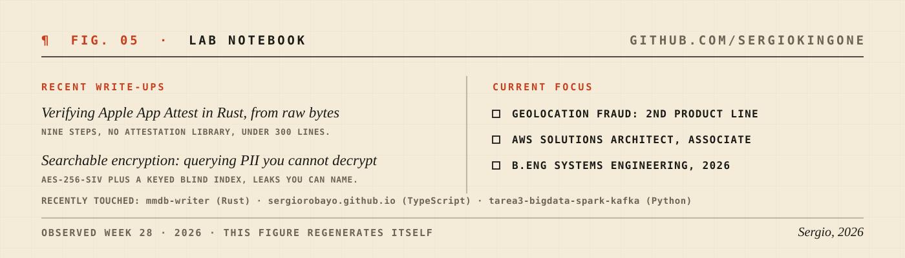

<picture>
  <source media="(prefers-color-scheme: dark)" srcset="assets/hero-dark.svg">
  
</picture>

I build production backend systems from scratch. Rust is my main language, AWS is home ground, and the domain rotates: fraud prevention and identity today at [Surt](https://www.surt.com), AI and computer vision systems before that at Vertex Studio. Same pattern both times: join early, learn the domain deeply, build the core, ship it.

<picture>
  <source media="(prefers-color-scheme: dark)" srcset="assets/range-dark.svg">
  
</picture>

<picture>
  <source media="(prefers-color-scheme: dark)" srcset="assets/metrics-dark.svg">
  
</picture>

The habit that ties it together: when the right tool does not exist, I build it from primitives.

<picture>
  <source media="(prefers-color-scheme: dark)" srcset="assets/primitives-dark.svg">
  
</picture>

<picture>
  <source media="(prefers-color-scheme: dark)" srcset="assets/now-dark.svg">
  
</picture>

### Field notes

Long-form write-ups of things I built and what they taught me, linked from my [LinkedIn featured section](https://www.linkedin.com/in/sergio-robayo-500584216/):

- **Verifying Apple App Attest in Rust, from raw bytes.** All nine steps, no attestation library, under 300 lines, tested against a real captured device attestation.
- **Searchable encryption: querying PII you cannot decrypt.** AES-256-SIV plus a keyed blind index, with every leak named and bounded.

Colophon: this page is a build artifact. Five figures, two color surfaces (switch your theme), one generator: <a href="generate/">generate/</a>. Hand-set type as code, embedded fonts, no stat widgets, no screenshots. Figure 05 re-renders itself weekly by CI, the same way anything worth running gets run: tokens, codegen, pipeline.
