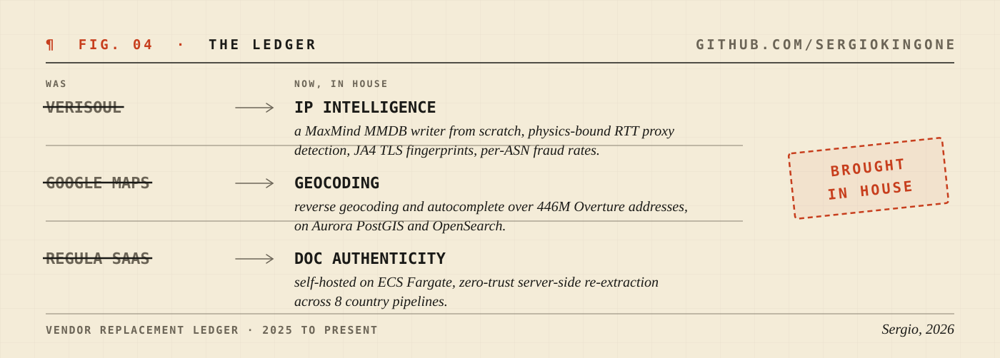

<picture>
  <source media="(prefers-color-scheme: dark)" srcset="assets/hero-dark.svg">
  
</picture>

I joined [Surt](https://www.surt.com) as its first backend engineer and built the platform from a blank repo: a Rust and AWS fraud-prevention system that now runs identity verification for Dogg House Casino, Rebet, and 8 other production clients across 5 countries. A year later I lead the backend.

<picture>
  <source media="(prefers-color-scheme: dark)" srcset="assets/pipeline-dark.svg">
  
</picture>

<picture>
  <source media="(prefers-color-scheme: dark)" srcset="assets/metrics-dark.svg">
  
</picture>

The throughline of my work: join at zero, build the core solo, then pull the expensive third parties in-house, one system at a time.

<picture>
  <source media="(prefers-color-scheme: dark)" srcset="assets/ledger-dark.svg">
  
</picture>

### Selected instruments

| repo | what it is |
|---|---|
| [`mmdb-writer`](https://github.com/SergioKingOne/mmdb-writer) | Write MaxMind DB (`.mmdb`) files in pure, safe Rust. A file format the ecosystem had readers for, but no writer. Built for production IP intelligence, released for everyone. |
| [`kafka`](https://github.com/SergioKingOne/kafka) | My own Kafka implementation. The best way to trust a system is to have built one. |
| [`http-server`](https://github.com/SergioKingOne/http-server) | An HTTP server in Rust, from the socket up. |
| [`multithreaded-web-server`](https://github.com/SergioKingOne/multithreaded-web-server) | Thread pools and graceful shutdown, by hand. |

<picture>
  <source media="(prefers-color-scheme: dark)" srcset="assets/now-dark.svg">
  
</picture>

### Field notes

Long-form write-ups of things I built and what they taught me, linked from my [LinkedIn featured section](https://www.linkedin.com/in/sergio-robayo-500584216/):

- **Verifying Apple App Attest in Rust, from raw bytes.** All nine steps, no attestation library, under 300 lines, tested against a real captured device attestation.
- **Searchable encryption: querying PII you cannot decrypt.** AES-256-SIV plus a keyed blind index, with every leak named and bounded.

### Contact

[LinkedIn](https://www.linkedin.com/in/sergio-robayo-500584216/) · [sergiorobayorr@gmail.com](mailto:sergiorobayorr@gmail.com) · Bogota, Colombia (remote, worldwide)

Colophon: this page is a build artifact. Five figures, two color surfaces (switch your theme), one generator: <a href="generate/">generate/</a>. Hand-set type as code, embedded fonts, no stat widgets, no screenshots. Figure 05 re-renders itself weekly by CI, the same way anything worth running gets run: tokens, codegen, pipeline.
