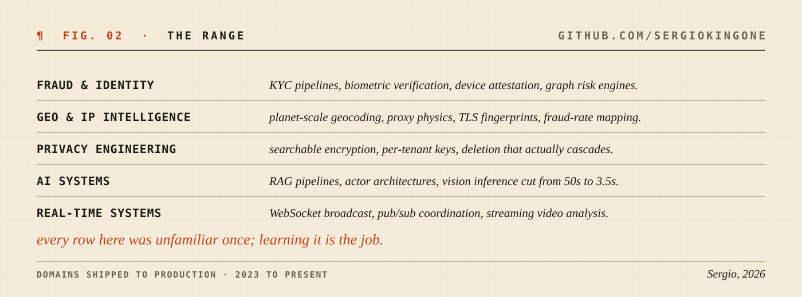
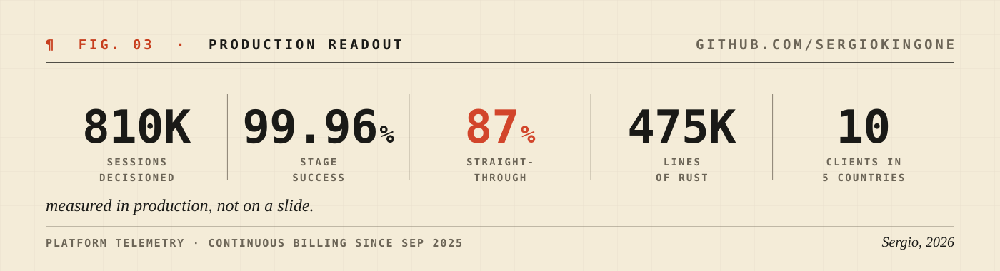
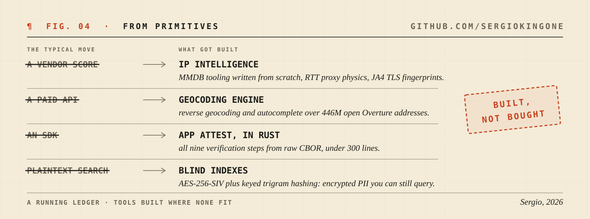

<picture>
  <source media="(prefers-color-scheme: dark)" srcset="assets/hero-dark.svg">
  
</picture>

I build production backend systems from scratch. Rust is my main language, AWS is home ground, and the domain rotates: fraud prevention and identity today at [Surt](https://www.surt.com), AI and computer vision systems before that at Vertex Studio. Same pattern both times: join early, learn the domain deeply, build the core, ship it.

<picture>
  <source media="(prefers-color-scheme: dark)" srcset="assets/range-dark.svg">
  
</picture>

<picture>
  <source media="(prefers-color-scheme: dark)" srcset="assets/metrics-dark.svg">
  
</picture>

The habit that ties it together: when the right tool does not exist, I build it from primitives.

<picture>
  <source media="(prefers-color-scheme: dark)" srcset="assets/primitives-dark.svg">
  
</picture>
